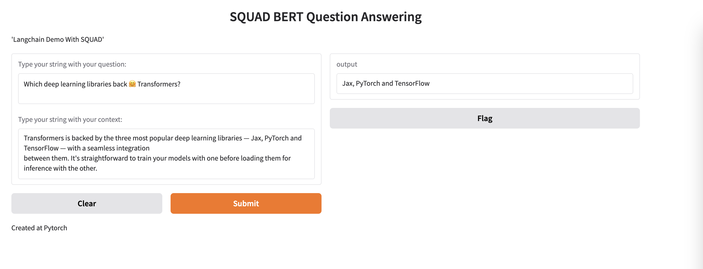

# QUESTION_ANSWERING_Text2Text
<p align="center">   </p>

## Introduction

This is finetuning model of BERT to handle SQUAD task from NLP.

## Description

Dataset: `*squad*`

Language: `*pytorch*`

# Project Structure

This project follows the following folder structure:

```
squad_root/
├── config/
│   └── squad_config.py
├── data/
│   └── custom_data.py
├── models/
│   ├── preprocessing.py
│   ├── predictor.py
│   ├── squad_model.py
│   └── train.py
└── main.py
```

## Folder Descriptions

### config/
- **config.py**: Contains configuration settings for the project, such as hyperparameters and file paths.

### data/
- **custom_data.py**: Handles data loading, preprocessing, and dataset management.

### models/
- **preprocessing.py**: Contains functions for data preprocessing.
- **predictor.py**: Implements the `Predictor` class for making predictions.
- **squad_model.py**: Defines the model architecture and utilities.
- **train.py**: Contains the training loop and functions to train the model.

### main.py
- The main script to run the project, including loading data, training the model, and making predictions.

## How to use

1. Training:

`python3 train.py`

2. Inference:

`python3 predictor.py`

3. Pipeline for Gradio Deployment

`python3 main.py`
